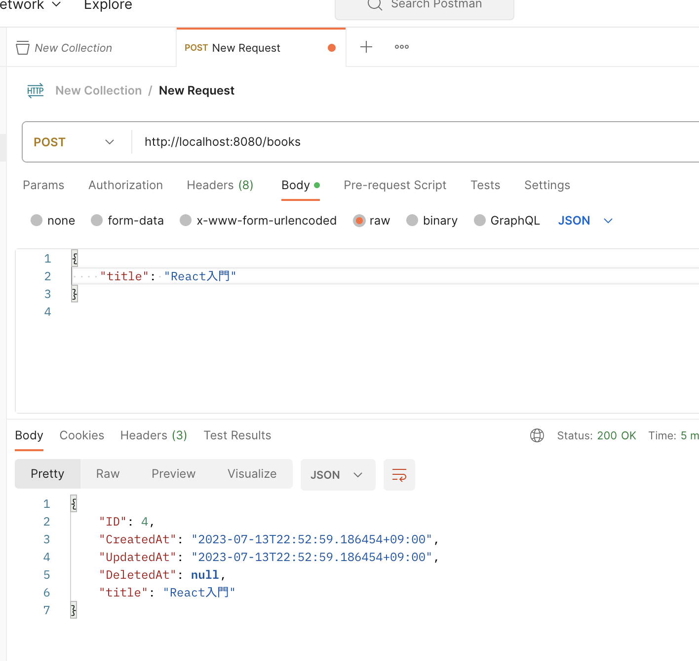

# Go言語でMySQLを使ってみる

go modを実行する
```
go mod init example/hello
```

必要なパッケージを追加
```
go get github.com/gin-gonic/gin
go get github.com/jinzhu/gorm
go get github.com/jinzhu/gorm/dialects/mysql
```

こちらが、MySQLと接続するためのコード
```go
package main

import (
	"github.com/gin-gonic/gin"
	"github.com/jinzhu/gorm"
	_ "github.com/jinzhu/gorm/dialects/mysql"

	"net/http"
)

type Book struct {
	gorm.Model
	Title string `gorm:"type:varchar(100)" json:"title"`
}

var DB *gorm.DB

func main() {
	var err error
	DB, err = gorm.Open("mysql", "user:password@/dbname?charset=utf8&parseTime=True&loc=Local")
	if err != nil {
		panic("failed to connect database")
	}
	defer DB.Close()

	DB.AutoMigrate(&Book{})

	r := gin.Default()

	r.GET("/books", getBooks)
	r.POST("/books", createBook)

	r.Run()
}

func getBooks(c *gin.Context) {
	var books []Book
	if err := DB.Find(&books).Error; err != nil {
		c.JSON(http.StatusInternalServerError, gin.H{"error": "Error while getting books"})
		return
	}
	c.JSON(http.StatusOK, books)
}

func createBook(c *gin.Context) {
	var book Book
	if err := c.BindJSON(&book); err != nil {
		c.JSON(http.StatusBadRequest, gin.H{"error": err.Error()})
		return
	}
	if err := DB.Save(&book).Error; err != nil {
		c.JSON(http.StatusInternalServerError, gin.H{"error": "Error while creating book"})
		return
	}
	c.JSON(http.StatusOK, book)
}
```

コンパイルを実行するコマンド
```
go run hello.go
```
{
    "title": "Goプログラミング入門"
}

## 📡エンドポイント
http://localhost:8080/books

</img>
</img>
</img>
</img>
</img>